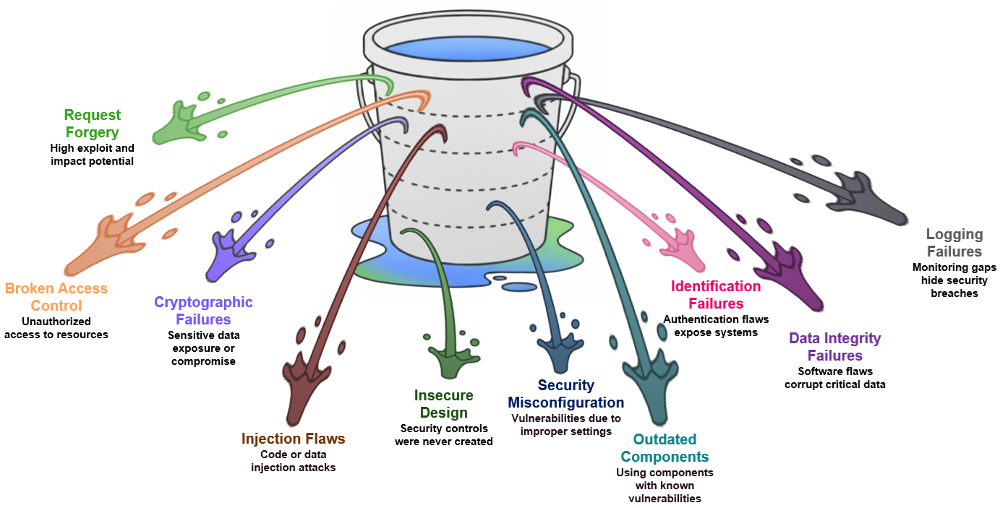

# XP260 - Mastering Secure Application Development in SAP BTP: A Practical Workshop

## Description

This repository contains the material for the SAP TechEd 2025 session called "XP260 - Mastering Secure Application Development in SAP BTP: A Practical Workshop".  

## Overview

Welcome to this hands-on workshop dedicated to embedding security into your SAP BTP applications. 
In an era where data breaches and cyber threats are constant, building secure software is not an option - it's a requirement. This workshop is designed for developers working with the SAP Cloud Application Programming Model (CAP) and Node.js. 

By completing the exercises, you will gain the practical skills to identify and mitigate common security risks as defined by the [OWASP Top 10 vulnerabilities](https://owasp.org/Top10/). 

  
   
  <b>Top 10 OWASP Vulnerabilities</b>

### 🎯 Learning Objectives

-	**Identify and Mitigate** a critical OWASP Top 10 vulnerability in a real-world scenario.
-	**Leverage**  the SAP Cloud Application Programming Model (CAP) for secure, cloud-native development.
-	**Implement** SAP BTP's comprehensive, built-in security services to protect your data and business logic.
-	**Validate** the effectiveness of security fixes through practical testing.

## Requirements

You already have some experience with Node.js and GitHub.

💡In some of the exercises, you will be asked to switch from one user to another. This works more reliably if you use the Incognito mode of your browser. Without the Incognito mode, you may run into situations where you are authenticated automatically with the wrong user.

## Exercises

Every exercise module is a self-contained lab focused on a specific vulnerability. All modules adhere to the following standard structure:

- 📖 **1. Overview:** A high-level description of the vulnerability, its impact, and why it's a security risk.
- 🚨 **2. Vulnerable Code:** A snippet of code containing the specific security flaw. We'll analyze why it's insecure.
- 💥 **3. Exploitation:** A step-by-step guide on how to exploit the vulnerability, demonstrating its real-world impact.
- 🛡️ **4. Remediation:** The corrected version of the code that patches the vulnerability, along with an explanation of the fix.
- ✅ **5. Verification:** A simple procedure to confirm that the patch has successfully mitigated the vulnerability and the exploit no longer works.
- 📌 **6. Summary:** A practical recap that consolidates the exercise outcomes with actionable takeaways.

💡In step 4, you will replace the vulnerable version of the code with a corrected version. In most cases you will have to open the corrected file and copy the full content into the development environment. If you only copy the code snippet explaining the fixes, your application won't work. To copy the content of the file, use the button "Copy raw file" in the toolbar above the file content.

This structure is designed to help you understand a vulnerability from an attacker's perspective and a defender's, see how it can impact a CAP application, and learn actionable steps to mitigate it with SAP BTP best practices. 

- [Getting Started](exercises/ex0#getting-started)
- [Exercise 1 - Broken Access Control](exercises/ex1#exercise-1---broken-access-control)
    - [Exercise 1.1 - Horizontal Privilege Escalation](exercises/ex1/ex1.1/README.md#exercise-11---horizontal-privilege-escalation)
    - [Exercise 1.2 - Vertical Privilege Escalation](exercises/ex1/ex1.2/README.md#exercise-12---vertical-privilege-escalation)
- [Exercise 2 - SQL Injection](exercises/ex2/README.md#exercise-2---sql-injection)
- [Exercise 3 - Security Logging and Monitoring Failures](exercises/ex3/README.md)
    - [Exercise 3.1 - Audit Logging for Sensitive Data Access in Local Development](exercises/ex3/ex3.1/README.md)
    - [Exercise 3.2 - Security Event Monitoring in SAP BTP Production Environment](exercises/ex3/ex3.2/README.md)
- [Additional Resources](exercises/resources/README.md)

## Code of Conduct
Please read the [SAP Open Source Code of Conduct](https://github.com/SAP-samples/.github/blob/main/CODE_OF_CONDUCT.md).

## How to obtain support

Support for the content in this repository is available during the actual time of the online session for which this content has been designed. Otherwise, you may request support via the [Issues](../../issues) tab.

## License
Copyright (c) 2025 SAP SE or an SAP affiliate company. All rights reserved. This project is licensed under the Apache Software License, version 2.0 except as noted otherwise in the [LICENSE](LICENSES/Apache-2.0.txt) file.
