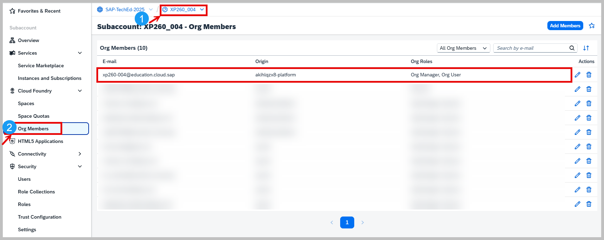
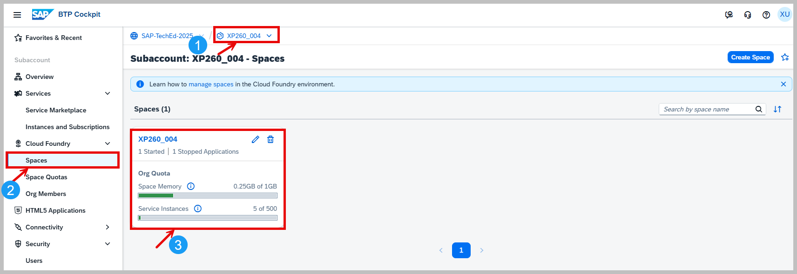
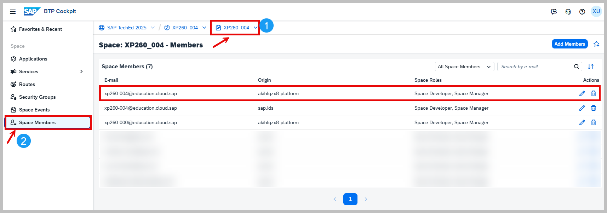

# Getting Started

# Table of Contents

- [Overview](#overview)
  - [Business Scenario](#business-scenario)
  - [Solution Diagram](#solution-diagram)
- [Access Your SAP BTP Subaccount](#access-your-sap-btp-subaccount)
  - [Review the Subscribed Services and Instances](#review-the-subscribed-services-and-instances)
    - [Subscriptions](#subscriptions)
    - [Instances](#instances)
    - [Environments](#environments)
  - [Review the Configured User Access](#review-the-configured-user-access)
- [Review the Development Environment](#review-the-development-environment)
- [Launch SAP Business Application Studio](#launch-sap-business-application-studio)
- [Login to Your Cloud Foundry Environment from SAP Business Application Studio](#login-to-your-cloud-foundry-environment-from-sap-business-application-studio)
  - [Login Using the User Interface (UI)](#login-using-the-user-interface-ui)
  - [Login Using the Command Line (Terminal)](#login-using-the-command-line-terminal)
- [Launch SAP Build Work Zone](#launch-sap-build-work-zone)
- [Summary](#summary)
- 
## Overview 

In this Hands-on exercises, we will be using the [Incident Management application](https://discovery-center.cloud.sap/protected/index.html#/mymissiondetail/143790/), which is designed as a reference application for the [SAP BTP Developer's Guide](https://help.sap.com/docs/btp/btp-developers-guide/btp-developers-guide). It showcases best practices for developing applications on SAP Business Technology Platform (BTP).
 
### Business Scenario
ACME, a leading electronics company, uses this application to manage customer service incidents. The application supports the following business process:
  1. A customer contacts ACME's call center with an issue.
  2. A call center representative (Processor) receives the call.
  3. The representative creates a new incident in the system based on the customer's complaint.
  4. The conversation details are recorded as part of the incident.

### Solution Diagram
The solution diagram illustrates the key components and their interactions within the Incident Management Application deployed on SAP Business Technology Platform (BTP).

  <p align="center">
    
    <br>
    <b></b>
  </p>

## Access your SAP BTP Subaccount
- Access your SAP BTP account for the session XP260 using this link: [Global Account: SAP-TechEd-2025 – Account Explorer](https://emea.cockpit.btp.cloud.sap/cockpit?idp=akihlqzx8.accounts.ondemand.com#/globalaccount/4c772782-0751-42ee-93c3-897452fdcb63/accountModel&//?section=HierarchySection&view=TreeTableView)

- ⚠️ **Note:** You will use an SAP BTP subaccount with a subaccount admin privileges. We use the Identity Authentication service tenant **akihlqzx8.accounts.ondemand.com** as custom identity provider, both for platform and application users.

- Login to open your subaccount **XP260_0XX**, where **XX** is your seat number : 
  - Username: **xp260-0XX@education.cloud.sap** ( with XX depending on your seat from 01 - 40 )
  - Password: Will be given to you as part of the session
  - In the list of directories and subaccounts, click on the entry for your subaccount.

### Review the Subscribed Services and Instances 

#### Subscriptions

| Application                           | Plan             |
| :------------------------------       | :--------------- |
| Audit Log Viewer Service              | free             |
| SAP Business Application Studio       | standard-edition |
| SAP Build Work Zone, standard edition | standard         |

#### Instances

| Instance Name                       | Service                                    | Plan        |
| :------------------------------     | :-------------------------------------     | :---------- |
| incident-management-auth            | Authorization and Trust Management Service | application |
| incident-management-db              | SAP HANA Schemas & HDI Containers          | hdi-shared  |
| incident-management-destination     | Destination Service                        | lite        |
| incident-management-html5-repo-host | HTML5 Application Repository Service       | app-host    |
| incident-management-html5-runtime   | HTML5 Application Repository Service       | app-runtime |

#### Environments

| Environment Name    | Plan       |
| :------------------ | :-------   |
| Cloud Foundry Runtime | standard |

- Check the subscriptions, instances and the environment under Subaccount **XP260_0xx > Instances and Subscriptions** in the **SAP BTP cockpit**.
 
  <p align="center">
    
    <br>
    <b></b>
  </p>

#### Review the Configured User Access

1- Check the users under **Security > Users**.

2- Check your user **xp260-0XX@education.cloud.sap**. There will be two representations in the cockpit, one as **platform user** and one as **business user**. 

3- Check the role collections assigned to the platform user representation:
    - Select the user.
    - In the right frame, check if the role collection **'Subaccount Administrator'** is assigned.
    - Check the role collections assigned to the **business user** representation:
    - Select the user.
    - In the right frame, check if the following role collections are assigned:
      - **Business_Application_Studio_Administrator**
      - **Business_Application_Studio_Developer**
      - **Business_Application_Studio_Extension_Deployer**
      - **Launchpad_Admin**
      - **Subaccount Viewer**

  <p align="center">
    
    <br>
    <b></b>
  </p>

3- You will make use of some test users to test the application you are working on :
  - **bob.support@company.com** (Support user)
  - **alice.support@company.com** (Support user)
  - **david.admin@company.com** (Admin user)
  - Check the user role collections in the SAP BTP cockpit for **Bob, Alice, and David**:
      - Select a user. In the right frame, check the role collections assigned:
      - Check if **bob.support@company.com** and **alice.support@company.com** are assigned to the role collection **Incident Management Support**. 
      - Check if **david.admin@company.com** is assigned to the role collection **Incident Management Admin**.

 <p align="center">
    
    <br>
    <b></b>
  </p>

## Review the Development Environment
 
1- As we are using Cloud Foundry, check under **Cloud Foundry > Org Members** , if your platform user **xp260-0XX@education.cloud.sap** has **Org Manager,Org User** under **Org Roles**. 

 <p align="center">
    
    <br>
    <b></b>
  </p>

2- Under **Cloud Foundry > Spaces**, verify the existence of your space called **'XP260-0XX'**.
  
 <p align="center">
    
    <br>
    <b></b>
  </p>

3- Under Space **XP260-0XX > Space Members**, verify if your platform user **xp260-0XX@education.cloud.sap** has **Space developer, Space Manager** under **Space Roles**.

 <p align="center">
    
    <br>
    <b></b>
  </p>

## Launch SAP Business Application Studio

Now after these checks, you can open the SAP Business Application Studio. 

1- Navigate to **Services > Instances and Subscriptions** in the **SAP BTP cockpit**. Then click on the small **Go to Application** icon next to the name SAP Business Application Studio.

 <p align="center">
    
    <br>
    <b></b>
  </p>

2- On the logon screen, click on the IDP 'akihlqzx8.accounts.ondemand.com' to login with single sign-on (SSO).
 <p align="center">
    
    <br>
    <b></b>
  </p>

3- Enter email and password in the login window.

 <p align="center">
    
    <br>
    <b></b>
  </p>

4- You will see your Dev Space called 'secure_incident_management'. Make sure it is in a running state, if not start it.

 <p align="center">
    
    <br>
    <b></b>
  </p>
  
5- When it is running, click on 'secure_incident_management' to open the SAP Business Application Studio with your incident management application.

 <p align="center">
  
  <br>
  <b></b>
</p>

6- Click on the incident-management to open the application in your workspace.

 <p align="center">
  
  <br>
  <b></b>
</p>

- In the Workspace on the right side, you will find your incident management application in the list of projects.
 <p align="center">
  
  <br>
  <b></b>
</p>

7- Bookmark your SAP Business Application Studio link.

## Login to Your Cloud Foundry Environment from SAP Business Application Studio
Once you have SAP Business Application Studio open with your secure incident management project, you need to authenticate with your Cloud Foundry environment to deploy and manage applications.

### Login Using the User Interface (UI)

1. In SAP Business Application Studio, open the **Command Palette** (press **Ctrl+Shift+P** or select **View > Command Palette**) from Hamburger menu.

 <p align="center">
  
  <br>
  <b></b>
</p>
  
2. Search for and select **CF: Login to Cloud Foundry**.
3. You’ll see a **Cloud Foundry Sign In Targets**. Follow these steps:
4. Click on the link **Open New Browser** to generate your SSO Passcode.
5. Select **Sign in to another account**
6. Enter the origin key of your indentity provider: **akihlqzx8-platform**
7. Click on button **Sign in with an alternative identity provider**
8. Copy the temporary authentication code generated in the **Passcode** field.
9. Paste the **SSO Passcode** back into BAS and click on **Sign In** button
10. In section **Cloud Foundry Target** select **Organization** and **Space** (for example, `XP260-0XX`)
11. Click on **Apply** button
12. Once connected, a pop up in the status bar in BAS should display your org and space information.
  
### Login Using the Command Line (Terminal)

1. **Open Terminal**
   - In SAP Business Application Studio, go to **Terminal > New Terminal** from the top menu
   - A terminal window will open at the bottom of your workspace in your project directory **secure-incident-management**
2. **Run the following command to log in:**
  ```
  cf login -a https://api.cf.eu10-004.hana.ondemand.com  --origin akihlqzx8-platform
  ```
3- When prompted:
  * Email: xp260-0XX@education.cloud.sap
  * Password: Use the password provided during the session.
    
4- To verify the login, run
  ```
    cf target
  ```
You should see the current organization and space listed.

## Launch SAP Build Work Zone

Go back to Services > Instances and Subscriptions in the SAP BTP cockpit. Click on the 'Go to Application' icon next to the SAP Build Work Zone, standard edition application to open the SAP Build Work Zone application. 

Check if the Secure Incident Management Site is present. Click on the "Go to site" icon. When the Incident Management tile is displayed, sign out of the application and login with the alice.support@company.com user. Click on the tile to open the incident management application and bookmark the URL. 

Now you are ready to start the exercises. 

## Summary

Now that you have made yourself familiar with the setup,
continue to - [Exercise 1 - Broken Access Control](../ex1/README.md)
