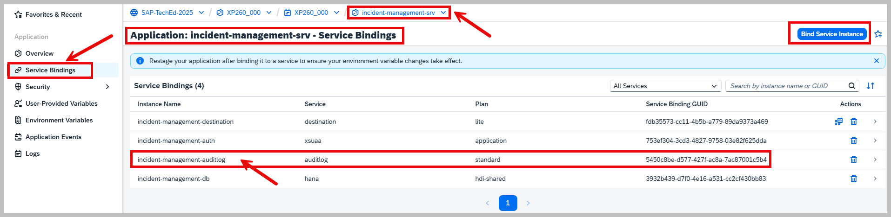
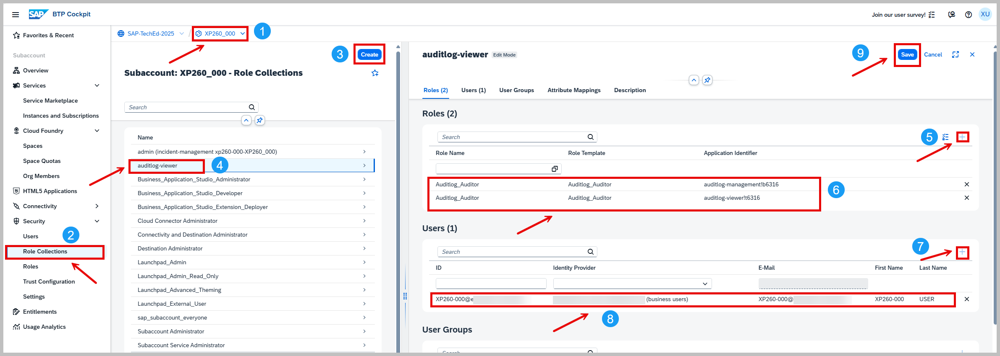

# Exercise 3.2 – Security Event Monitoring in SAP BTP Production Environment

Vulnerability: [A09:2021-Security Logging and Monitoring Failures](https://owasp.org/Top10/A09_2021-Security_Logging_and_Monitoring_Failures/)


## Table of Contents
- [📖 1. Overview](./README.md#--1-overview)
- [🚨 2. Vulnerable Code](./README.md#-2-vulnerable-code)
- [💥 3. Exploitation](./README.md#-3-exploitation)
- [🛡️ 4. Remediation](./README.md#%EF%B8%8F-4-remediation)
- [✅ 5. Verification](./README.md#-5-verification)
- [📌 6. Summary](./README.md#-6-summary)

## 1. Overview

In this exercise you will extend the local audit-logging setup from [Exercise 3.1 - Audit Logging for Sensitive Data Access in Local Developemt](../ex3.1/README.md) to production-grade SAP BTP Cloud Foundry environment.

### 🎯 Key Learning Objectives

  * Design and implement comprehensive audit logging events that tracks and validates authenticated access to sensitive data endpoints.
  * Bind the managed SAP Audit Log Service to your application.
  * Build and Deploy the application on the SAP BTP Cloud Foundry runtime.
  * Use the SAP Audit Log Viewer to access, filter, and analyze audit trails with full context (user, timestamp, action, resource)

## 📋 Prerequisites

* Completed [Exercise 3.1 - Audit Logging for Sensitive Data Access](../ex3.1/README.md).
* SAP Work Zone Standard Edition configured and accessible.
* The SAP Audit Log Viewer service has already been subscribed to in your SAP BTP subaccount with the standard plan.

## 🚨 2. Vulnerable Code:
Your existing [data-privacy.cds](../ex3.1/srv/data-privacy.cds) file only covers the Customers and Addresses entities. However, it is missing annotations for the Incidents entity and its conversation element. This gap can lead to significant privacy and compliance risks.


```

using { sap.capire.incidents as my } from './services';

// Annotating the my.Customers entity with @PersonalData to enable data privacy
annotate my.Customers with @PersonalData : {
  EntitySemantics : 'DataSubject',
  DataSubjectRole : 'Customer'
} {
... Other fields
}

// Annotating the my.Addresses entity with @PersonalData to enable data privacy
annotate my.Addresses with @PersonalData : {
  EntitySemantics : 'DataSubjectDetails'
} {
... Other fields
}


/* ❌ VULNERABLE SECTION: Missing data privacy annotations for Incidents entity */
// These are critical for ensuring proper handling of personal data in incidents,
// such as marking potentially personal fields, and
// protecting sensitive conversation messages.

```

**Why This is Vulnerable:**

❌ **No data classification:** Key incident fields (e.g., title, urgency, assignedTo, and conversation messages) are missing sensitivity classifications which are required for triggering audit logs and managing data retention policies.

❌ **Compliance Gap:** The absence of required privacy annotations for incident records creates a compliance gap with regulations like GDPR and other industry standards, potentially leading to legal penalties and security breaches.

## 💥 3. Exploitation
In this section, you will demonstrate the exploitation of the vulnerability through the following steps:

 - Integrate the audit logging feature into your CAP (Cloud Application Programming) application.
 - Build and deploy the application in its current vulnerable state to SAP BTP Cloud Foundry environment.
 - Verify the deployment to confirm the application is operational and ready for demonstrating the exploitation of the vulnerability in subsequent steps.
 - Simulate a support user accessing and updating sensitive incident data.
 - Configure audit log viewer access permissions for your user. 
 - Use the SAP Audit Log Viewer to Verify Insufficient Logging.

#### 🪜 Step 1. Integrate Audit Logging Feature into CAP Application

- ⚠️ Note: Ensure **[@cap-js/audit-logging](../ex3.1/README.md#step-1-add-audit-logging-dependency)** is Installed.

- ▶️ **Action:** Execute the following command in your terminal
    ```
      cds add audit-logging --plan standard
    ```

  - Open [mta.yaml](./mta.yaml) and scroll to the line 207 - **resources:** section (no edit required).
  - Confirm the following resource exists under the **resources:** section

    ```
    - name: incident-management-auditlog
      type: org.cloudfoundry.managed-service
      parameters:
        service: auditlog
        service-plan: standard
    ```
  - Then, locate the incident-management-srv module and verify that the **requires:** section includes the binding in line 33 :  
    
    ```
    requires:
      - name: incident-management-auditlog    
    ```

- ✅ **Result:** The mta.yaml file is updated to include the audit log resource under **resources:** section and the corresponding binding in the **incident-management-srv** module under **requires:** section.
  
#### 🪜 Step 2. Build and deploy the CAP appplication

- ⚠️ Note: Ensure you're logged in to your Cloud Foundry space via the **cf CLI** command or **Business application file explorer UI** before deploying.
  
- ▶️ **Action: Build the MTA**
  - Open a terminal and navigate to the project root directory.
  - Run the following command to build the MTA, Alternatively, if using an IDE like SAP Business Application Studio: Right-click on the [mta.yaml](./mta.yaml) file in the file explorer. Select the option **Build MTA Project**.

 ```
   mbt build
 ```

- ✅ **Result:** An **MTAR archive** (for example, incident-management_1.0.0.mtar) is created in the mta_archives/ directory.
  
- ▶️ **Action: Deploy the MTA**
  - Locate the generated .mtar file in the mta_archives/ directory.
  - Run the following command in your terminal to deploy it:

```
 cf deploy mta_archives/<mtar_name>.mtar
```
- ✅ **Result: The deployment succeeds**, and the vulnerable application is now running in your SAP BTP Cloud Foundry environment.

#### 🪜 Step 3. Verify the Deployment (Optional)

- ▶️ **Action: Confirm the Application’s Deployment Status**
   - Log in to your SAP BTP Cockpit and navigate to your subaccount, then open Spaces > Your Space> Applications

- **Result:** Ensure that your application is listed as **Started.** see screenshot:

  <p align="center">
    
    <br>
    <b></b>
  </p>

- ▶️ **Action: Verify the Audit Log Service Binding**
   - Open the Application **incident-management-srv** > **Service Bindings** section.
   - Confirm that the following service binding is present:
     * Service Binding Name: **incident-management-auditlog**
     * Service: **auditlog**
     * Plan: **standard**

- ✅ **Result: The audit log service binding is confirmed as active and correctly configured**, along with other required services. see screenshot:

  <p align="center">
    
    <br>
    <b></b>
  </p>


#### 🪜 Step 4. Simulate a Support User Accessing and Updating Sensitive Incident Data

- ▶️ **Action: Modify a record using the Application UI:**
  - Log in to the incident management application UI using a support account (e.g., alice.support@company.com).
  - Navigate to the list of incidents and select a record.
  - Modify one or more fields (e.g., Customer, Title, Urgency, Status,Message ) within the record and save your updates.

- ✅ **Result: The incident record is successfully updated**, and the UI reflects the changes.


#### 🪜 Step 5. Configure Audit Log Viewer Access Permissions

- ⚠️ Note: To retrieve the audit logs for your subaccount using the SAP Audit Log Viewer service, you need to have proper authorizations. Complete the following steps before accessing the SAP Audit Log Viewer.
- ▶️ **Action: Create a Role Collection for Audit Log Viewer Access**
  - Log in to the SAP BTP Cockpit with your assigned user **XP260-0xx@education.cloud.sap (Business User)** and navigate to your subaccount.
  - Go to Security > Role Collections.
  - Click the Create button.
  - Enter the following details:
    - Role Collection Name: **auditlog-viewer**
    - Description: **Access to Audit Log Viewer** (optional)
  - Click Create.

- ✅ **Result: A new role collection named auditlog-viewer is created.**

- ▶️ **Action: Add Roles to the Role Collection and Assign the Role Collection to Your User**
     - In the Role Collections list, locate and click on the **auditlog-viewer role collection** you just created.
     - Click the **Edit** button.
     - In the **Roles** sections, add the following roles:
        - Role Name : **auditlog-viewer**
        - Role Description :  **View audit logs**
        - Role Name : **auditlog-management**
        - Role Description :  **Read access to audit logs**
    - In the **Users** section, add your user email (e.g., XP260-0xx@education.cloud.sap) as Business User
    - Click Save.

- ✅ **Result: Roles Successfully Assigned**
    - The required roles have been added to the **auditlog-viewer** role collection, which is now assigned to your user account. This enables you to access the **SAP Audit Log Viewer** service, see screenshot
      
    <p align="center">
    
    <br>
    <b></b>
  </p>


#### 🪜 Step 6. Use the SAP Audit Log Viewer to Verify Insufficient Logging

- ▶️ **Action:**
  - Log in to the SAP BTP cockpit with your subaccount user **XP260-0xx@education.cloud.sap** and navigate to the SAP Audit Log Viewer.
  - Apply filters for **data-modification** and **data-access** events.
  - Set the date/time range to match when the support user modified the incident record (e.g., Oct 20, 2025, 5:00 PM to Oct 20, 2025, 5:10 PM).
  - Execute the filter query to retrieve the log entries.
  - Locate the log entry corresponding to the support user (e.g., alice.support@company.com).

- ✅ **Result:**
  - **You will notice that the specific field values and modifications** (customer, title, urgency, status, message) are **NOT displayed in the audit log.**
  - **This reveals the vulnerability:** Without @PersonalData annotations, sensitive data modifications are not properly logged for audit and compliance purposes see screenshot:

    <p align="center">
    
    <br>
    <b></b>
  </p>


## 🛡️ 4. Remediation
To address the identified vulnerability of insufficient logging for sensitive incident data, this section implements SAP CAP's built-in security controls through:
  - **Personal Data Annotation** – Explicitly tags sensitive fields in incident records for GDPR compliance.
  - **Automated Audit Logging** – Tracks all access and modifications to protected data with @cap-js/audit-logging.

#### 🪜 Step 1. Annotate Personal Data for Incidents

- ▶️ **Action:**
  - Copy the contents of **[data-privacy.cds](./srv/data-privacy.cds)** into project’s **/srv/data-privacy.cds** file.
  - Open **data-privacy.cds** file from your project and make sure the annotations for Incidents, and Incidents.conversation are present—exactly as shown here.

```
using { sap.capire.incidents as my } from './services';

... // Customer Annotations

... // Addresses Annotations

// Annotating the my.Incidents entity with @PersonalData to enable data privacy
annotate my.Incidents with @PersonalData : {
  EntitySemantics : 'DataSubjectDetails'                            // Incidents relate to data subjects (customers)
} {
  customer        @PersonalData.FieldSemantics : 'DataSubjectID';   // Link to customer
  title           @PersonalData.IsPotentiallyPersonal;              // May contain PII
  urgency         @PersonalData.IsPotentiallyPersonal;
  status          @PersonalData.IsPotentiallyPersonal;
  assignedTo      @PersonalData.IsPotentiallyPersonal;              // Email of assigned support user
}
// Annotate the conversation element of Incidents
annotate my.Incidents.conversation with @PersonalData : {
  EntitySemantics : 'Other'
} {
  message         @PersonalData.IsPotentiallySensitive;
};

```

✅ **Result:**
- The data privacy annotations for the Incidents entity and its conversation element have been successfully configured. This enables the following security and compliance capabilities:
  - **Incident Entity Protection:**
     - ✅ **Entity Classification:** The Incidents entity is marked as **DataSubjectDetails**, establishing that incident records contain information related to data subjects (customers).
     - ✅ **Customer Linkage:** The customer field is explicitly classified as **DataSubjectID**, creating a clear audit trail, linking each incident to its associated data subject.
     - ✅ **Field-Level Sensitivity Classification:** The fields title, urgency, status, and assignedTo are marked as **IsPotentiallyPersonal**, triggering automatic audit logging for any access or modification to these fields.

  - **Conversation Message Protection:**
    - ✅ Sensitive Message Logging: The message field within the conversation element is marked as **IsPotentiallySensitive**, ensuring that all conversation messages—which may contain personal details, private communications, or sensitive customer information—are captured in the audit log with complete context.
    - ✅ Enhanced Audit Trail: Any create, read, update, or delete operation on conversation messages will now generate detailed audit log entries, providing a forensic record for compliance audits and threat detection.

## ✅ 5. Verification
In this section, you will verify that the remediation has successfully resolved the  [A09:2021-Security Logging and Monitoring Failures](https://owasp.org/Top10/A09_2021-Security_Logging_and_Monitoring_Failures/) vulnerability. This verification is organized into two key areas:
 
 - *(Optional)* Verify conversation data retrieval and logging in your local development environment.
 - Verify that authorized modifications to sensitive data are correctly logged with full detail, capturing the context of the change.
 - Verify unauthorized access attempts are blocked and logged as **Security Events**.

#### 🪜 Step 1. Retrieve Conversation Details for Local Development (Optional)
-  ⚠️ **Note:** This optional step allows you to verify the audit logging functionality and conversation details in your local development environment before performing end-to-end testing in the cloud.

- ▶️ **Action:**
  - Ensure cds watch is running in your terminal. Start it if needed:

  ```
   cds watch
  ```
  - Open the [test/http/incident-conversations.http](./test/http/Incident-conversations.http) file from your project.
  - Ensure that the username is set to **alice (support user)**. The password should be left empty.
  - Click on 'Send Request' to run 'GET {{server}}/odata/v4/processor/Incidents?$expand=conversation' request.

- ✅ **Result:**
  - Here is a sample audit log output showing SensitiveDataRead events for incident conversation data. In your log, the timestamp matches the current timestamp:

  ```
  ... Other logs
  [audit-log] - SensitiveDataRead: {
    data_subject: {
      id: { ID: '1004100' },
      role: 'Customer',
      type: 'ProcessorService.Customers'
    },
    object: {
      type: 'ProcessorService.Incidents.conversation',
      id: {
        up__ID: 'de6a36d1-098c-4429-9dd9-eb3fb1078ce7',
        ID: '24227258-de86-4e64-9386-dbca83cc27b8'
      }
    },
    attributes: [ { name: 'message' } ],
    uuid: '8b8a528b-3346-4176-844c-8c6e099bf45d',
    tenant: undefined,
    user: 'alice',
    time: 2025-10-22T10:16:39.514Z
  } 
  ```
-  ⚠️ **Note:** To generate detailed audit log entries for create, update, or delete operations on incidents and conversations entities, open and run HTTP requests from the [ProcessorService.http]( [test/http/incident-conversations.http](./test/http/ProcessorService.http) file. Each request will trigger corresponding audit log events (SensitiveDataRead, PersonalDataModified, or SecurityEvent) visible in the terminal.

 #### 🪜 Step 2. Rebuild and Deploy the Remediated Application

- ▶️ **Action: Build and Deploy the Updated MTA**
  - Open a terminal and navigate to the project root directory.
  - Run the following commands to build the updated MTA with the corrected data-privacy.cds annotations:
  ```
   mbt build
  
   cf deploy mta_archives/<mtar_name>.mtar
  ```
- ✅**Result:** The remediated application is now running in your SAP BTP Cloud Foundry environment with the @PersonalData annotations for the Incidents entity and its conversation element.

#### 🪜 Step 2. Simulate Authorized Data Modification and Verify Comprehensive Logging

- ▶️ **Action: Perform an Authorized Modification**
   - Log in to the incident management application UI using a support account (e.g., alice.support@company.com).
   - Navigate to the list of incidents and select an incident assigned to you.
   - Modify one or more sensitive fields:
     - Title – Change the incident title
     - Urgency – Update the priority level
     - Status – Move to a different status (e.g., from "open" to "in-progress")
     - Message – Add a new conversation message with additional context
   - Save your updates and confirm the changes appear in the UI.

- ✅**Result: The incident record is successfully updated without any access denial errors.**

- ▶️ **Action: Access the SAP Audit Log Viewer and Verify Detailed Logging**
   - Log in  with your user (e.g., XP260-0xx@education.cloud.sap)to the SAP BTP Cockpit and navigate to the SAP Audit Log Viewer.
   - Apply the following filters:
     - Event Type: data-modification, data-access
     - Date/Time Range: Set the range to match when you performed the modification (e.g., Oct 20, 2025, 5:00 PM to 5:10 PM)
     - User: Filter by the support user account (e.g., alice.support@company.com)
  - Execute the filter query to retrieve the log entries.
  - Locate the log entry corresponding to your incident modification.
  
- ✅ **Result:**
  - Detailed audit logs now display sensitive field modifications – Unlike the vulnerability demonstrated in Step 5 of Exploitation, the audit log now shows complete information for all modified incident fields (customer, title, urgency, status, assignedTo, message) with their before and after values.

  - Complete traceability achieved – Each modification entry includes:
    - The specific fields that were changed
    - The exact values before and after modification
    - The user who made the change (alice.support@company.com)
    - The precise timestamp of the modification.
    - The object type 'ProcessorService.Incidents and subject type 'ProcessorService.Customers'

  - Vulnerability fully remediated – Insufficient logging is resolved, with comprehensive audit trails ensuring GDPR compliance and enhanced data privacy. see screenshot

    <p align="center">
    
    <br>
    <b></b>
  </p>
